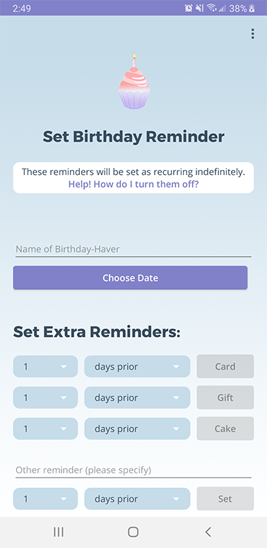

## About
A mobile app that creates a central place where you can keep track of birthdays and gift ideas, as well as set recurring reminders/notifications for birthday-related tasks (e.g., buy gift, get card ... )

This Java application was built in Android Studio. Optimized for API 28: Android 9.0 (Pie)+

## Demo Video
https://youtu.be/deOnTTJIet0

## Screenshots

